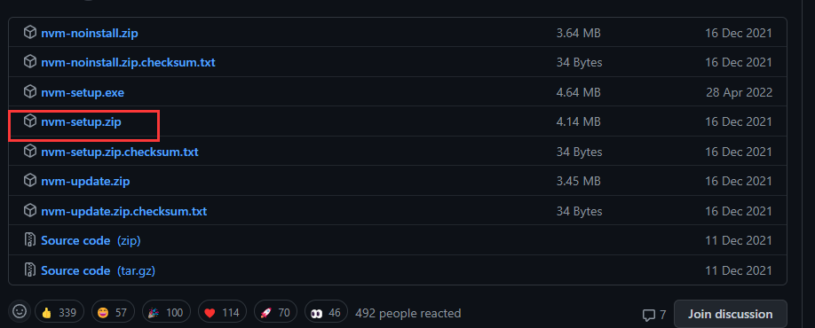

# nvm
[nvm](https://github.com/nvm-sh/nvm)是为了解决node各种版本存在不兼容现象，让你在同一台机器上安装和切换不同版本的node的工具。
## 软件安装
苹果用户可以使用brew进行安装
```bash
brew install nvm
```
如果不能执行请修改 .zshrc 文件并在最后添加以下内容
```bash
export NVM_DIR="$HOME/.nvm"
  [ -s "/usr/local/opt/nvm/nvm.sh" ] && . "/usr/local/opt/nvm/nvm.sh"  # This loads nvm
  [ -s "/usr/local/opt/nvm/etc/bash_completion.d/nvm" ] && . "/usr/local/opt/nvm/etc/bash_completion.d/nvm"  # This loads nvm bash_completion
```
重新加载配置 cs
```bash
source ~/.zshrc
```
windows 用户请下载安装 [nvm-windows](https://github.com/coreybutler/nvm-windows/releases)
  
::: tip 友情提示
先卸载原本电脑上的node，然后在进行nvm安装
:::
## 常用命令
列出所有可安装的 node 版本
```bash
nvm ls-remote
```
安装指定版本 node
```bash
nvm install 18
```
切换使用指定的版本 node
```bash
nvm use <version>
```
查看本地已安装的 node 版本，同时也会显示当前使用的 node 版本
```bash
nvm list
```
显示当前版本
```bash
nvm current
```
删除指定版本，将删除该版本安装的所有包
```bash
nvm uninstall <version>
```
## 常见问题
如果之前使用 npm 安装过扩展包，现在想使用 NVM 进行管理。则首先需要从全局中删除 node_modules 目录
```bash
# 查看全局 node_modules 目录
npm root -g
```
