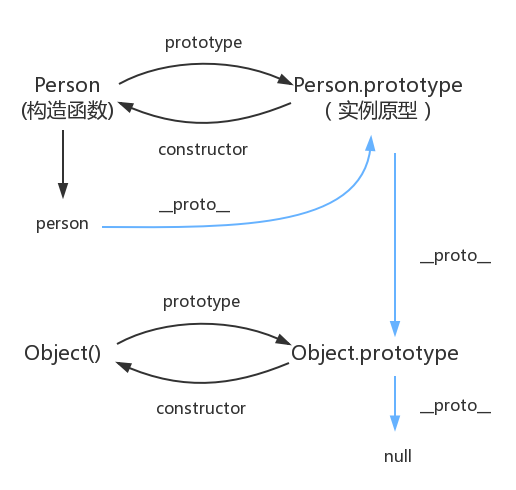

# javaScript
## 数据类型
JavaScript 现在有八种数据类型，包括 7 个基础类型和 1 个引用类型。

基础类型：

1. 空值（null）
2. 未定义（undefined）
3. 布尔值（ boolean）
4. 数字（number）
5. 字符串（string）
6. 符号（symbol，ES6 新增）
7. 对象（bigint，ES11 新增）

引用类型：

1. 对象(object)
## 作用域和闭包
作用域是根据名称查找变量的一套规则，作用域分为`全局作用域`和`局部作用域`、ES6的`块级作用域`

全局作用域：任何地方都能访问到的就是全局作用域

1. 函数最外部定义的变量拥有全局作用域
2. 未定义直接赋值的变量会自动声明为拥有全局作用域
```javascript
function a {
   b = 1
}
a()
console.log(b) //1 
```
3. 浏览器下window的属性拥有全局作用域

局部作用域：在固定的代码片段内可访问到，一般是指函数里声明的，所以局部作用域也叫函数作用域。

局部变量只作用于函数内，在函数开始执行时创建，函数执行完后局部变量会自动销毁。

块级作用域：只在变量声明的代码块内有效（let、const）

作用域链：执行函数时先从函数内部寻找局部变量， 没找到就往上个作用域寻找，直到全局作用域为止，这个作用域之间行程的引用关系就是作用域链

闭包：在一个函数内返回一个新的函数，新的函数引用了外部函数的变量，这时候这个变量会存在堆里，在这个函数执行完后不会被销毁。这就形成了闭包。
闭包的目的是将变量放在局部作用域，保留这个引用，实现变量的隐藏。

下面是简单的例子，foo执行返回的函数保留了foo的局部变量，形成闭包
```javascript
function foo() {
   var a = 1
   return function() {
      a++
      console.log(a)
   }
}
var boo = foo()
```

闭包缺点和解决方法：带有闭包的函数只要存在就会一直保留隐藏的局部变量，根据`垃圾回收`的机制，被一个作用域引用的变量不会被回收，所以这个隐藏的局部变量将会一直存在，就造成了内存泄漏。解决方法就是销毁这个作用域，手动将这个函数对闭包变量的引用进行释放。接上面代码的例子：
```javascript
boo = null
```
## 原型链

每个函数都有 prototype 属性，这个属性就是原型，也是一个对象。创建的时候只有constructor一个属性，该属性指向构造函数本身。

每个对象都有`__proto__`属性，指向了创建该对象的构造函数的原型，也就是函数的prototype。这个属性指向了 [[prototype]]，但是 [[prototype]] 是内部属性，我们并不能访问到，所以使用 `__proto__` 来访问。

为了实现继承的方式，通过 `__proto__` 将对象和原型联系起来组成原型链，得以让对象可以访问到不属于自己的属性。



