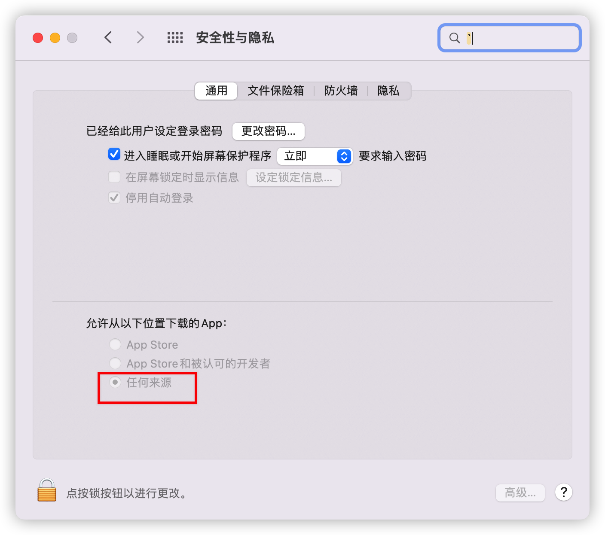

# 重置 NVRAM
---
如果电脑运行慢或不稳定可以尝试重置 NVRAM，操作步骤如下

将 Mac 关机，然后开机并立即同时按住以下四个按键：Option、Command、P 和 R。您可以在大约 20 秒后松开这些按键，在此期间您的 Mac 可能看似在重新启动。

如果 Mac 电脑发出启动声，您可以在第二次启动声过后松开这些按键。

> 如果不好掌握技巧，就以听到 4 次 DONG 的声音为主

# 第三方软件
---
因为苹果系统的安全机制，从互联网上下载的软件是不能执行的。

1 首先执行以下命令，开启允许安装任意源的应用

```shell
sudo spctl --master-disable
```

2 这时访问 安全与隐私 将可以看到，允许安装任何来源的应用



3 然后把软件安装好，一般情况是托到 应用程序中

4 然后再命令行中执行以下命令，后面的参数是你安装的应用程序

```shell
sudo xattr -r -d com.apple.quarantine  /Applications/你的软件
```
# 常用软件
---
1. iShot 截图软件
2. 自动输入法切换
3. Itsycal 菜单栏日历
4. Bandizip 压缩软件
5. Bartender 4 菜单栏应用管理工具
6. Beyond Compare 文件对比工具
7. Bob 翻译软件
8. Thor Launcher 应用快捷启动器 
9. Easy New File Creator 右键菜单创建文件