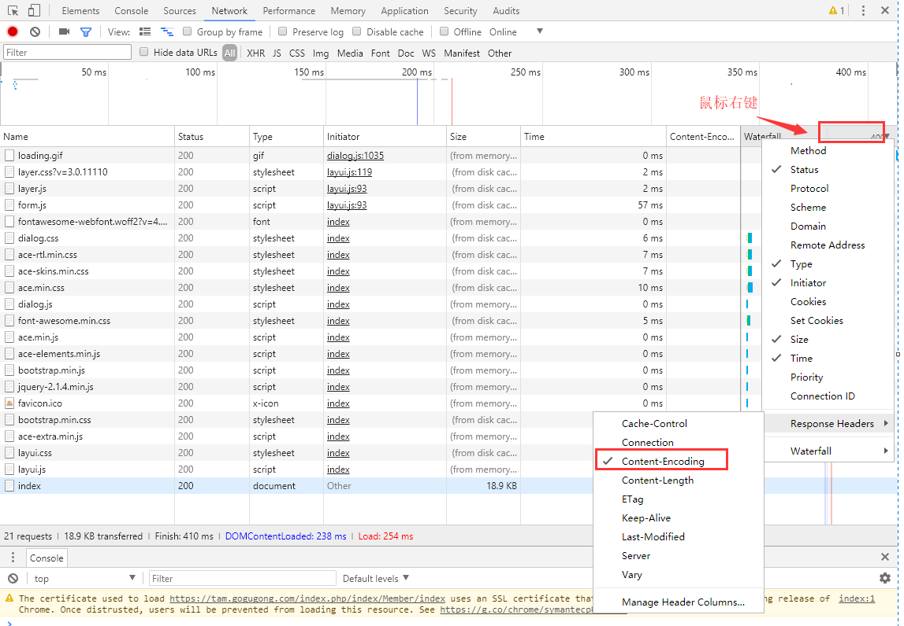
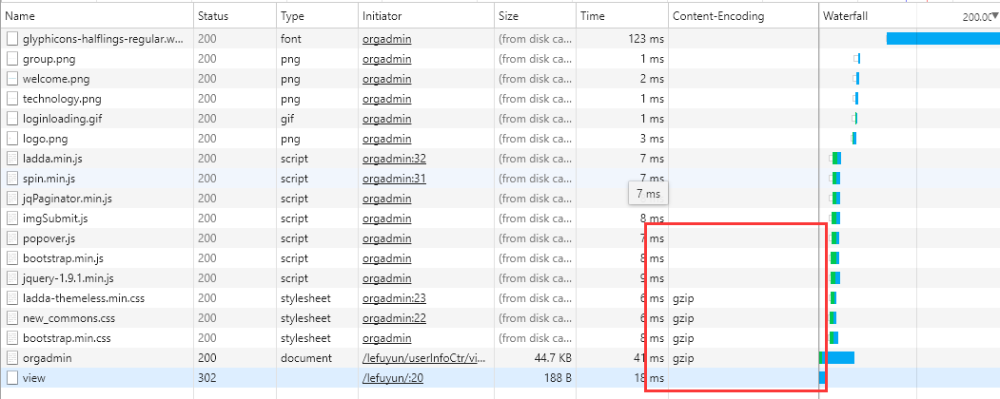

# 配置
## 如何查看页面是否开启了gzip压缩
1、谷歌浏览器 F12  
2、在表头单击鼠标右键

3、如果开启了 gzip 则显示 gzip，没有则是空

## 关闭新版chrome SameSite警告
chrome://flags/ 搜索Cookie deprecation messages 禁用即刻
chrome://settings/content/cookies cookie拦截
