# 1.你得拥有你的 GitHub 账号
有则登录，无则注册（官网 [https://github.com/](https://github.com/)）。
# 2.新建一个 gist
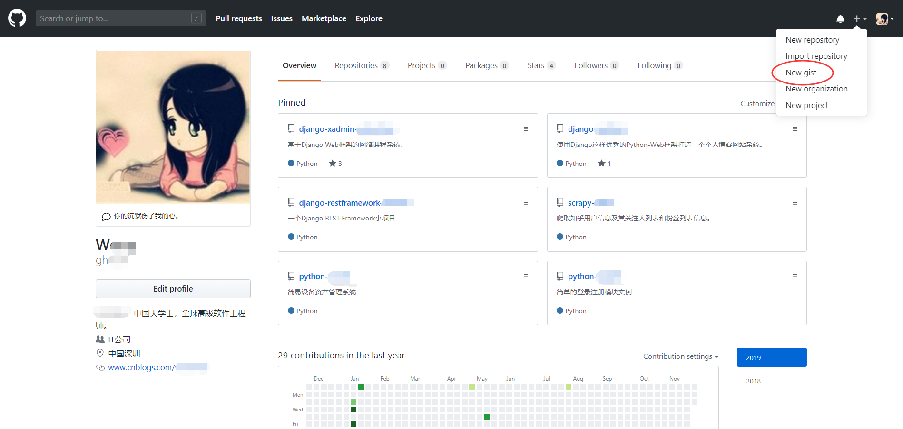
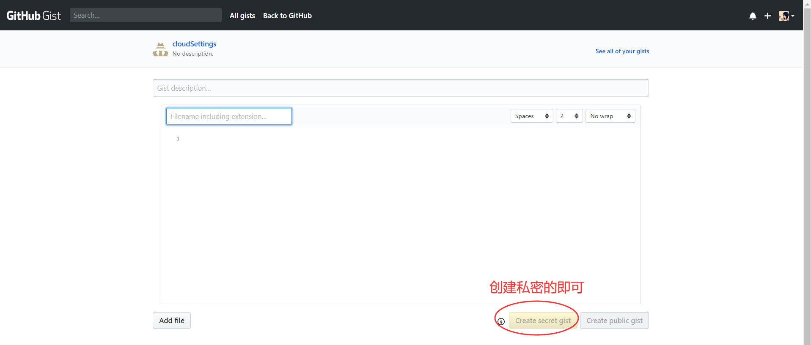
#  3.获取 gist ID号（可重复使用）
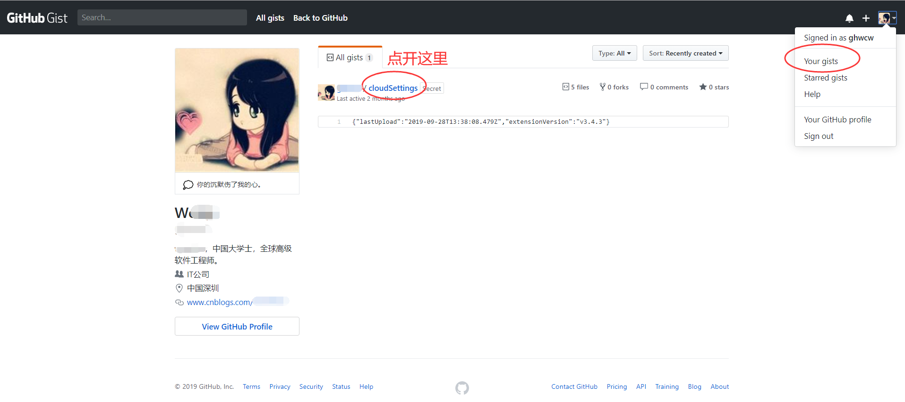
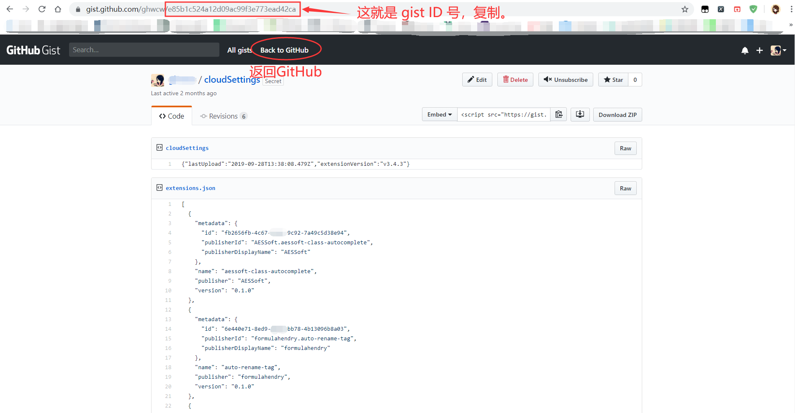
# 4.返回 GitHub，进入设置页创建令牌（只用一次）
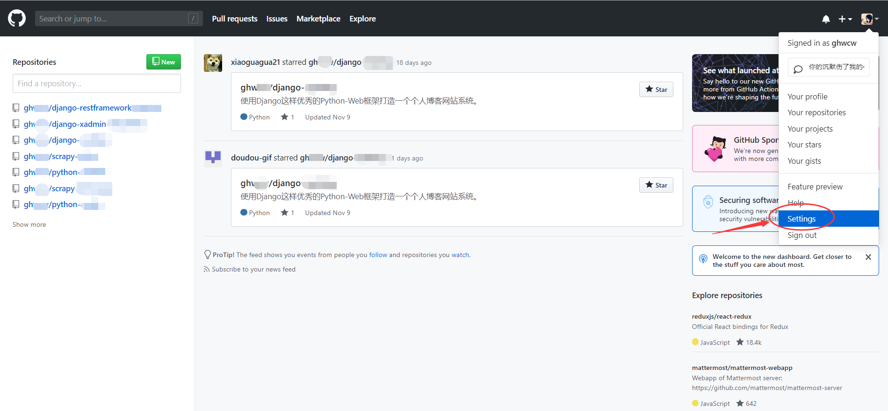
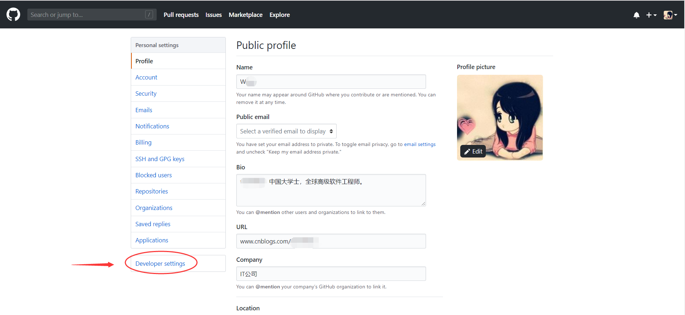
###  创建令牌（Token）
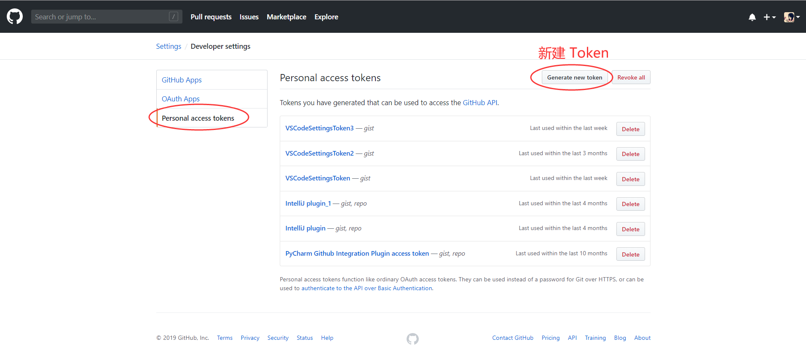
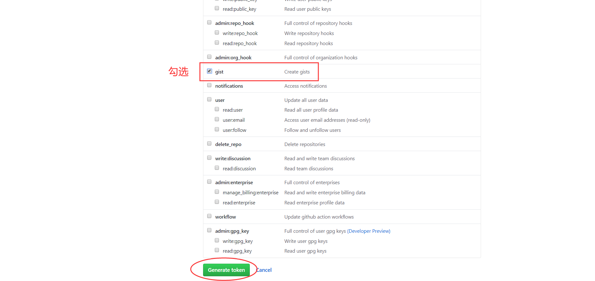
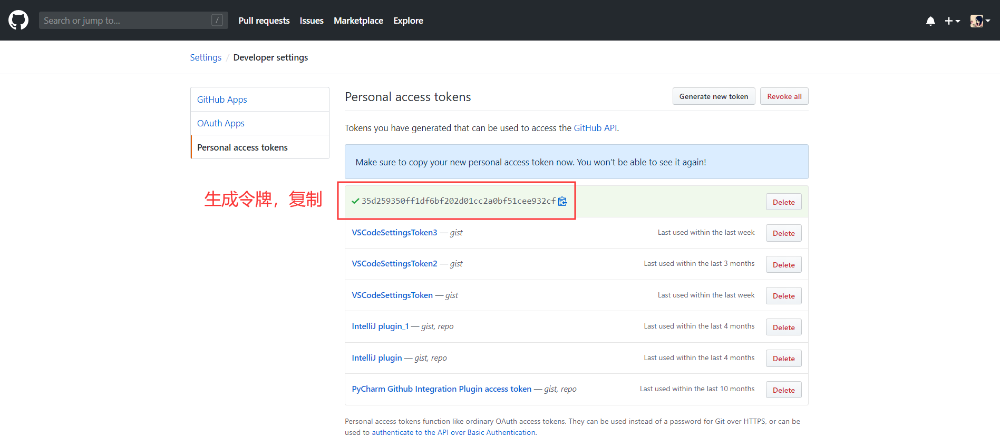
# 5.回到 VSCode
### 搜索并安装扩展：Settings Sync
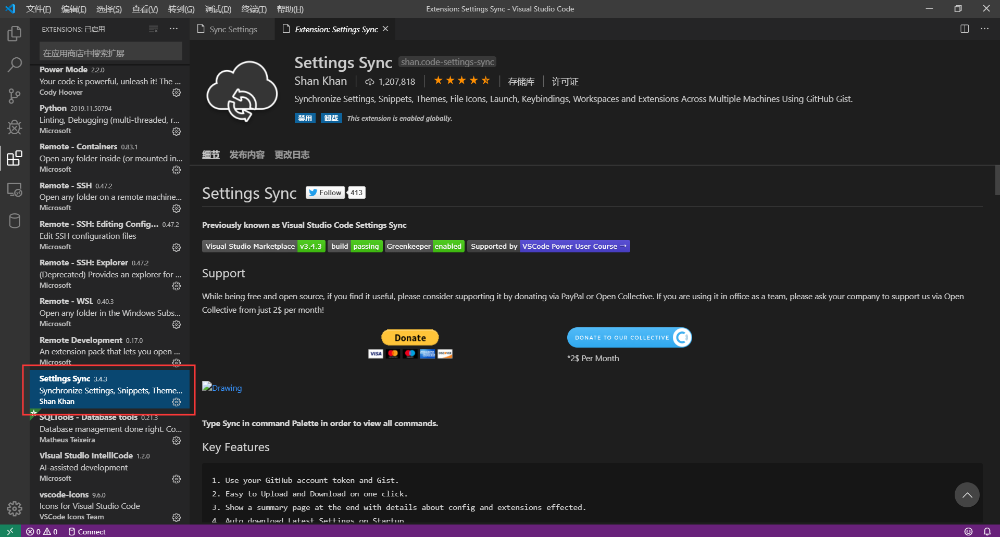
### 打开命令面板，输入 "sync"
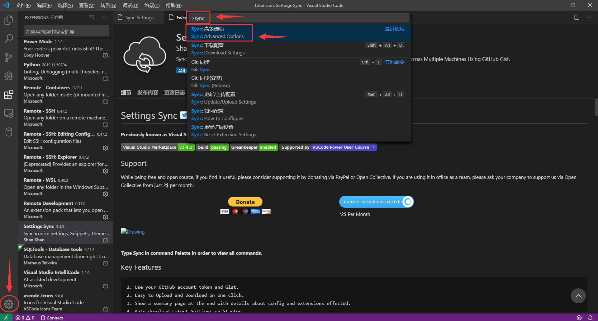
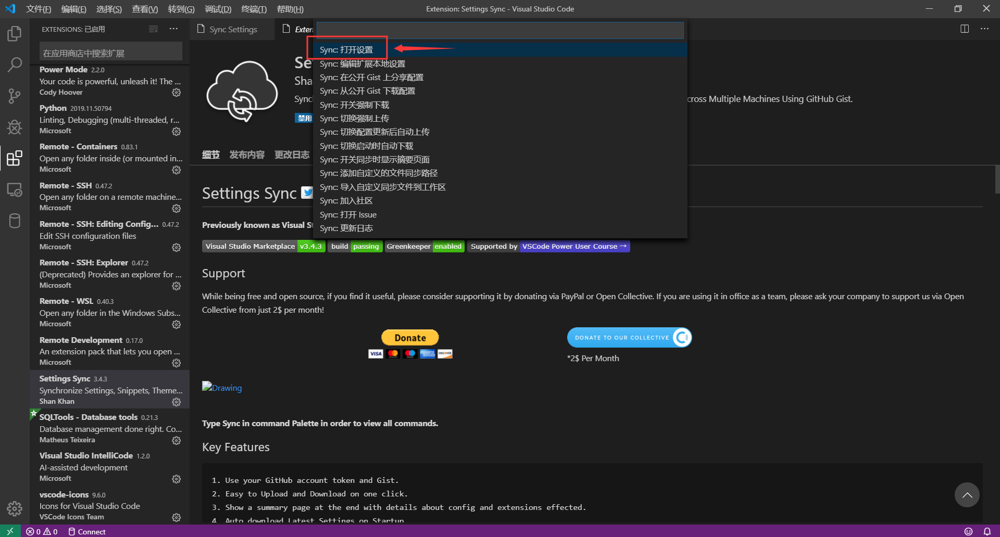
### 粘贴 gist ID 号和令牌
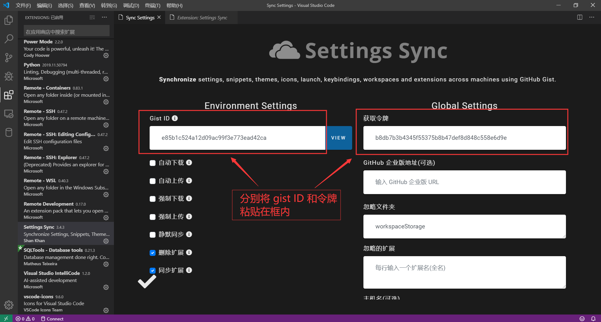
### 再次输入 "sync"，开始下载（Shift+Alt+D）或上传（Shift+Alt+U） VSCode 设置
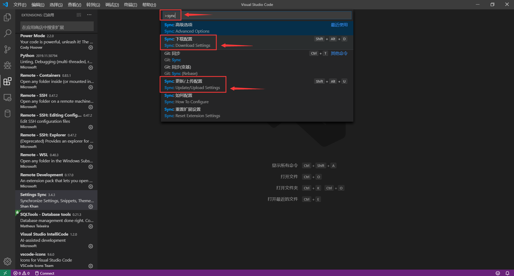
