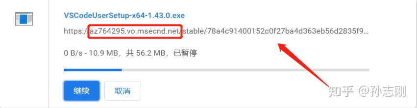
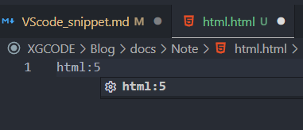
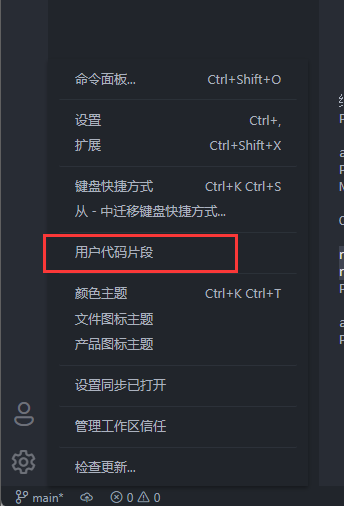

# VSCode 
[VSCode](https://code.visualstudio.com/) 是微软推出的跨平台、扩展组件丰富的文本编辑器。
## 软件安装
国内下载vscode速度慢问题解决  
首先在[官网](https://code.visualstudio.com/) 找到需要下载的文件，点击下载。
在浏览器或者下载软件中就可以看到这么一个下载地址了，将其复制下来（如下图箭头所指）。

然后将红框内的部分更换为[vscode.cdn.azure.cn](https://link.zhihu.com/?target=http%3A//vscode.cdn.azure.cn/)
这个就是国内的镜像了点开后你会发现速度直接起飞。
## 全局命令
在 windows 系统中在安装 VisualStudio Code 时选择设置 PATH 就可以在命令行全局使用了。  
在 Mac 系统中使用以下方式  
修改 `vim ~/.bash_profile` 如果安装了 `zsh` 修改 `vim ~/.zshrc`
添加 `export PATH=/Applications/Visual\ Studio\ Code.app/Contents/Resources/app/bin:$PATH`
## 代码片段
代码片段就是字面意思，“一段代码”。一段经常使用的代码，我们给他设置一个【快捷字符】，只要下次打出这个【快捷字符】它就会变出来！
::: tip 🌰举个栗子
我们每次写HTML 都要写一大片基础的结构，而设置好了代码片段,只需要打`html:5`👇  
    
按下回车键👇 基础的代码就会出来了，不用再慢慢打了~  
  
:::
设置方式
  

  

然后写入👇
```json
{
  "tsvue":{
    "prefix":"tsvue",
    "body":[
      "<template>",
      "  <div class=\"\"></div>",
      "</template>",
      "",
      "<script setup>",
      "import {} from 'vue'",
      "</script>",
      "",
      "<style lang='scss' scoped></style>"
    ],
    "description":"vue3"
  }
}
```
参数说明
```text
prefix      :调起本片段的字符串
body        :这个是代码段的主体.需要设置的代码放在这里,字符串间换行的话使用\r\n换行符隔开.注意如果值里包含特殊字符需要进行转义.
　　　　　　　 多行语句的以,隔开
$1          :这个为光标的所在位置.
$2          :使用这个参数后会光标的下一位置将会另起一行,按tab键可进行快速切换,还可以有$3,$4,$5.....
description :描述文字
```
这样，我们每次写新的vue组件或页面时，就可以直接写`tsvue`,节约时间。